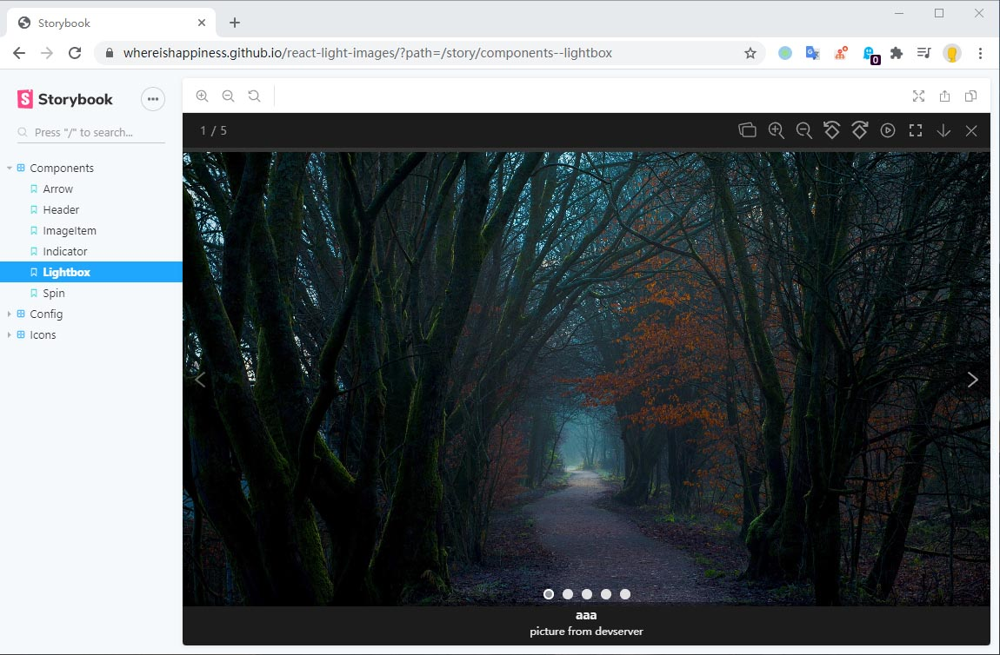

# react-light-images
another react image viewer

inspired by [lightGallery](https://github.com/sachinchoolur/lightGallery)

## screenshot



## demo

https://whereishappiness.github.io/react-light-images

## Main features

* Mouse drag support.
* Animated thumbnails.
* Full screen support.
* Supports zoom.
* Supports rotate.
* Responsive images.
* Auto play.

## Get Started

### install

```
npm i react-light-images
```

### Usage

```
import { Lightbox } from 'react-light-images';

const dataSource = [
  {
    title: 'street',
    src: 'https://w.wallhaven.cc/full/2e/wallhaven-2eq3gg.jpg',
    thumb: 'https://th.wallhaven.cc/small/2e/2eq3gg.jpg',
    description: 'japan street',
  },
  {
    title: 'food',
    src: 'https://w.wallhaven.cc/full/47/wallhaven-47z7oy.jpg',
    thumb: 'https://th.wallhaven.cc/small/47/47z7oy.jpg',
    description: 'meat egg bread fork',
  },
];

const App = () => <Lightbox dataSource={dataSource} />;
```

## Contributing!

All contributions are super welcome!
